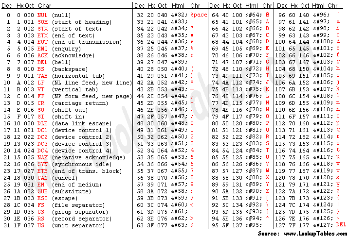

# What is ASCII?
The American Standard Code for Information Interchange (ASCII) provides computers with a unique mapping of text characters to byte values. 

Unlike some other forms of encryptions, information about ASCII is easily found all over the internet, so only the decoding method will be mentioned here. 

## ASCII Decoding

