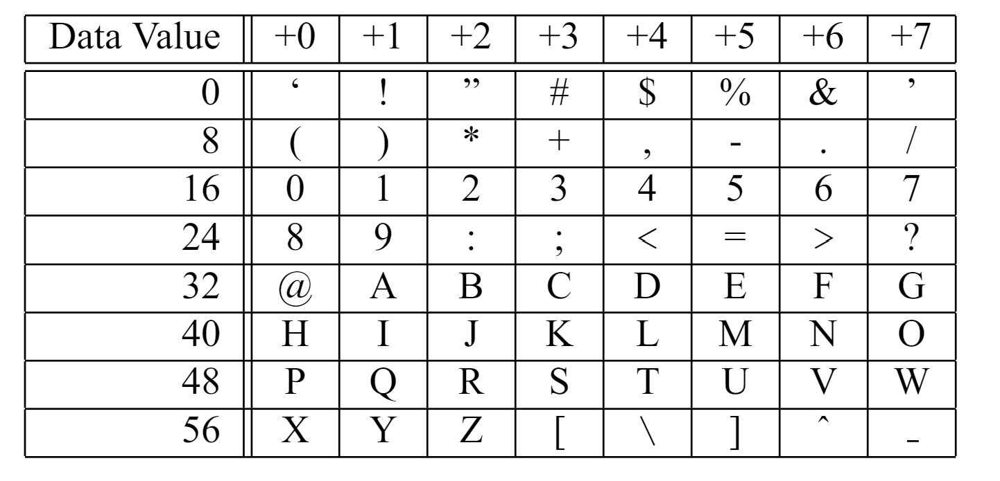

# Uuencoding Format

How can you tell if data has been encoded using Uuencoding?
Uuencoded data always starts with a "begin" line and terminates with an "end" line.

## Example:  

<b>begin</b> _mode filename_  
....encoded data....  
Empty Line  
<b>end</b>  
For our purposes, we will only focus on how to decode the encoded data.

# Encoding method

Uuencoding uses ASCII characters 32-64 to encode 65

## Worked Example

Let's take a look at how we would decode ",2&5L;&\@5V]R;&0A" by hand.  
